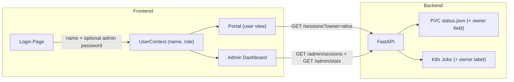

# Admin Portal with User Isolation

## Current State

- **Zero authentication** — no login, no user identity, no roles
- All sessions are visible to everyone via `GET /sessions`
- No `user` or `owner` field on jobs/sessions
- Frontend shows a hardcoded "Red Hat User" label

## Architecture

## Design Decisions

- **Identity**: Simple name entry on a login/welcome page. User enters their name (e.g. "Alice"). Name is stored in `localStorage` + React context. No passwords for regular users.
- **Admin access**: A hardcoded admin password (stored as env var `ADMIN_PASSWORD` in the API deployment). On the login page, an optional "Admin Password" field. If correct, role = `admin`; otherwise role = `user`.
- **Backend validation**: Admin endpoints require an `X-Admin-Token` header (hashed password check). Regular endpoints accept an `X-User` header to scope data.
- **Session ownership**: Every job gets an `owner` field in `status.json` and an `owner` label on the K8s Job.
- **Data isolation**: `GET /sessions` accepts `?owner=<name>` filter. Regular users always pass their name. Admin dashboard calls admin-only endpoints.

## Changes Required

### 1. Backend — [Version_V1/api.py](Version_V1/api.py)

- Add `ADMIN_PASSWORD` env var (default from `os.environ`, fallback to a reasonable default for dev)
- Add helper `_check_admin(request)` that validates `X-Admin-Token` header against `ADMIN_PASSWORD`
- Add `owner` field to `AnalyzeRequest` (required string)
- In `POST /analyze`: write `owner` into initial `status.json` and pass to `job_runner`
- In `GET /sessions`: add optional `?owner=` query param to filter results
- New `GET /admin/stats` endpoint (admin-only):
  - Total jobs submitted (all time), currently running, completed, failed
  - PVC disk usage (`shutil.disk_usage` on `/shared`)
  - Active worker pod count
- New `GET /admin/sessions` endpoint (admin-only): returns ALL sessions with `owner` column
- New `POST /admin/cancel/{session_id}` endpoint (admin-only): cancel any job
- New `POST /admin/delete/{session_id}` endpoint (admin-only): delete any session data
- New `POST /admin/validate` endpoint: accepts `{ password }`, returns `{ valid: true/false }`

### 2. Backend — [Version_V1/job_runner.py](Version_V1/job_runner.py)

- `create_analysis_job()`: accept `owner` param, add label `owner: <name>` to the K8s Job
- `_session_entry()`: include `owner` from `status_data`
- `list_all_jobs()`: accept optional `owner` filter param; when set, only return sessions where `status_data.owner == owner`

### 3. Backend — [Version_V1/worker.py](Version_V1/worker.py)

- Read `OWNER` env var (passed by job_runner via Job env)
- Preserve `owner` field in all `_write_status()` calls so it is never lost when the worker overwrites `status.json`

### 4. Frontend — New `contexts/UserContext.tsx`

- State: `{ name: string, role: 'user' | 'admin', adminToken?: string }`
- Persisted to `localStorage`
- `login(name, adminPassword?)` function:
  - If `adminPassword` is provided, call `POST /admin/validate` to verify; if valid, set role = admin
  - Otherwise, role = user
- `logout()` clears state
- `isAdmin` computed property

### 5. Frontend — New `components/LoginPage.tsx`

- Clean, branded login page with:
  - "Your Name" field (required)
  - "Admin Password" field (optional, collapsed/expandable)
  - "Enter" button
- On submit, calls `UserContext.login()`
- Redirects to `/` (Portal) on success

### 6. Frontend — [Frontend/src/App.tsx](Frontend/src/App.tsx)

- Wrap app with `UserProvider`
- If user not logged in, redirect all routes to `/login`
- Add `/login` route -> `LoginPage`
- Add `/admin` route -> `AdminDashboard` (only accessible when `role === 'admin'`)

### 7. Frontend — [Frontend/src/components/Portal.tsx](Frontend/src/components/Portal.tsx)

- Use `UserContext` to get current user name
- Pass `?owner=<name>` to `getSessions()` calls so user only sees their own jobs
- Replace hardcoded "Red Hat User" with the actual user name
- Pass `owner` in `startNewAnalysis()` calls

### 8. Frontend — New `components/AdminDashboard.tsx`

Full admin page with:

- **Stats cards row**: Total Jobs, Running, Completed, Failed, PVC usage
- **All sessions table**: Same as Portal jobs board but with added "Owner" column, showing ALL users' jobs
- **Actions**: Cancel/Delete buttons per job (calls admin endpoints)
- **System health section**: PVC disk usage bar, active pods count
- Auto-refresh polling (like Portal)

### 9. Frontend — [Frontend/src/components/Sidebar.tsx](Frontend/src/components/Sidebar.tsx) and TopNav in Portal

- Add "Admin" nav item (only visible when `isAdmin`)
- Replace "Red Hat User" with actual username from context
- Add "Logout" button

### 10. Frontend — [Frontend/src/services/api.ts](Frontend/src/services/api.ts)

- Update `getSessions(owner?)` to pass query param
- Update `startAnalysis()` to include `owner` field
- Add admin API functions:
  - `validateAdminPassword(password)`
  - `getAdminStats(token)`
  - `getAdminSessions(token)`
  - `adminCancelJob(token, sessionId)`
  - `adminDeleteJob(token, sessionId)`
- All admin functions pass `X-Admin-Token` header

### 11. K8s — [k8s/api-deployment.yaml](k8s/api-deployment.yaml)

- Add `ADMIN_PASSWORD` env var (from a Secret or inline for dev)

### 12. Frontend — [Frontend/src/contexts/AnalysisContext.tsx](Frontend/src/contexts/AnalysisContext.tsx)

- Accept `owner` from `UserContext` and pass it to `startAnalysis()` API call