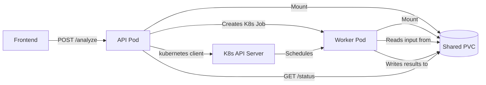

# K8s Job-based RCA Worker Architecture

## Current State

- The API pod runs the analysis **in-process** as a background thread ([`Version_V1/api.py`](Version_V1/api.py), lines 466-519)
- Only **one analysis per pod** is allowed (409 if busy) due to shared `sys.stdout` and in-memory state
- Results are written to `emptyDir` volumes that die with the pod
- Status is tracked in Python dicts (`_workflow_status`)

## Target Architecture



**Key idea:** One pre-built Docker image (the existing one), two entrypoints. The API pod uses `uvicorn api:app`, worker Jobs use `python worker.py`. No new Docker image build needed per job.

## Shared Storage Layout (PVC)

```
/shared/
  jobs/
    {session_id}/
      input/            # Extracted must-gather archive
      results/          # rca_summary.txt, RCA_High/Medium/Low.txt, etc.
      status.json       # Worker writes progress updates here
      config.json       # Copied from API's config at job creation time
```

## New Files

### 1. `Version_V1/worker.py` -- Standalone worker entrypoint

Reads environment variables and runs the orchestrator:

```python
# Env vars: SESSION_ID, USER_QUERY, MUST_GATHER_BASE_DIR, JOB_DIR
# Reads input from $JOB_DIR/input/
# Writes results to $JOB_DIR/results/
# Writes progress to $JOB_DIR/status.json
```

- Imports `OrchestratorAgent` exactly like `api.py` does today
- Implements a `progress_callback` that writes `status.json` atomically (write to `.tmp` then rename)
- On completion, writes final status with `"status": "completed"` or `"error"`
- For the **feedback/deepening** use case, accepts a `MODE=deepening` env var plus `ORCHESTRATOR_SESSION_ID` and `FEEDBACK_TEXT`

### 2. `Version_V1/job_runner.py` -- K8s Job management module

Encapsulates all Kubernetes Job operations:

- `create_analysis_job(session_id, user_query, must_gather_base_dir, ...)` -- builds and creates a `batch/v1 Job` resource
- `get_job_status(session_id)` -- reads `status.json` from the shared PVC + checks K8s Job status
- `cancel_job(session_id)` -- deletes the K8s Job (which terminates the pod)
- `cleanup_job(session_id)` -- deletes the completed Job resource and optionally the PVC data

Uses `kubernetes.client` with **in-cluster config** (`kubernetes.config.load_incluster_config()`).

Job spec will:

- Use the **same container image** as the API deployment (read from env var `WORKER_IMAGE`)
- Override command: `["python", "worker.py"]`
- Set env vars: `SESSION_ID`, `USER_QUERY`, `MUST_GATHER_BASE_DIR`, `JOB_DIR`
- Mount the **shared PVC** at `/shared`
- Mount the **GCP credentials** secret (same as API pod)
- Mount **config.json** from the app-config secret
- Set resource requests/limits appropriate for analysis workload
- Set `activeDeadlineSeconds` for a timeout safety net
- Set `backoffLimit: 0` (no retries on failure)

### 3. `k8s/shared-pvc.yaml` -- PersistentVolumeClaim

```yaml
apiVersion: v1
kind: PersistentVolumeClaim
metadata:
  name: must-gather-shared
  namespace: must-gather
spec:
  accessModes:
    - ReadWriteMany    # Required: API pod + worker pods read/write
  resources:
    requests:
      storage: 20Gi
```

Note: RWX access mode requires a storage class that supports it (e.g., NFS, CephFS, or GCP Filestore on GKE). On OpenShift, the default OCS/ODF StorageClass typically supports RWX.

### 4. `k8s/rbac.yaml` -- ServiceAccount + RBAC

The API pod needs permission to create/delete/watch Jobs:

```yaml
apiVersion: v1
kind: ServiceAccount
metadata:
  name: must-gather-api
  namespace: must-gather
---
apiVersion: rbac.authorization.k8s.io/v1
kind: Role
metadata:
  name: job-manager
  namespace: must-gather
rules:
  - apiGroups: ["batch"]
    resources: ["jobs"]
    verbs: ["create", "get", "list", "watch", "delete"]
  - apiGroups: [""]
    resources: ["pods", "pods/log"]
    verbs: ["get", "list"]
---
apiVersion: rbac.authorization.k8s.io/v1
kind: RoleBinding
# ... binds job-manager Role to must-gather-api ServiceAccount
```

## Modified Files

### 5. `Version_V1/api.py` -- Major refactor

**Remove:**

- `_active_workflow_thread`, `_active_workflow_thread_lock`, threading imports
- `_pod_is_busy()` single-session guard
- `run_workflow()` inner function and thread creation
- In-memory `_workflow_status` dict (replaced by file-based status)

**Replace with:**

- Import and use `job_runner` module
- `POST /analyze`: save uploaded file to shared PVC, call `job_runner.create_analysis_job()`
- `GET /status/{session_id}`: read `status.json` from shared PVC + K8s Job phase
- `POST /cancel/{session_id}`: call `job_runner.cancel_job()`
- `POST /feedback` (deepening): create a new K8s Job with `MODE=deepening`
- `GET /rca-summary`, `/rca-stage/{stage}`, `/workflow-console`: read from shared PVC path instead of local `Results/`
- `POST /pod-status`: return list of active jobs (not just busy/not-busy)
- **Multiple concurrent jobs** now supported (no more 409)

**Keep unchanged:**

- `/health`, `/config`, `/upload-must-gather` (but uploads go to shared PVC now)
- The API contract (request/response models) stays the same for frontend compatibility

### 6. `k8s/api-deployment.yaml`

- Add `serviceAccountName: must-gather-api`
- Add shared PVC volume mount at `/shared`
- Add env var `WORKER_IMAGE` (set to the same image tag)
- Remove `emptyDir` for `results-data` and `must-gather-data` (replaced by PVC)

### 7. `Version_V1/requirements.txt`

- Add `kubernetes` (the official K8s Python client)

## What Stays the Same

- **Frontend**: No changes needed. The API contract (`POST /analyze`, `GET /status/{session_id}`, etc.) is preserved. The only visible improvement is that the "pod is busy" error goes away.
- **Docker image**: Same `Dockerfile`, same image. Worker Jobs use the same image with `command: ["python", "worker.py"]` override.
- **Orchestrator code**: `orchestrator_agent.py` and all tools/analyzers are unchanged. `worker.py` calls them the same way `api.py` does today.

## Edge Cases and Considerations

- **Cleanup**: Completed Job resources and PVC data need periodic cleanup. `job_runner.cleanup_job()` handles per-session cleanup. A `ttlSecondsAfterFinished` field on the Job spec auto-deletes completed Jobs after a configurable period.
- **Worker image version**: The `WORKER_IMAGE` env var ensures API and worker always use the same image version. Set it in the Deployment manifest.
- **Secrets**: Worker Jobs mount the same GCP credentials and config.json secrets as the API pod.
- **Logging**: Worker stdout/stderr is captured by K8s. The `/workflow-console` endpoint can either read the file from PVC (worker writes it there) or use the K8s pod logs API.