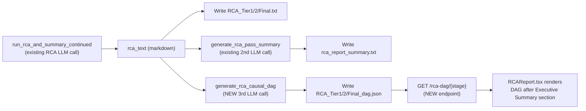

# RCA Causal DAG UI Integration

## How the DAG was actually built (tracing the logic, as requested)

For the two example diagrams (`rca-4372123-causal-dag.html`, `rca-4372123-dhcp-ovn-causal-dag.html`) I did **not** use the raw chronology array or the yaml/log payload sent to the original RCA LLM call. I only used the **finished RCA markdown report text** you pasted in chat:

1. Read `## Primary Root Cause(s)`, `## Secondary Causes / Contributing Factors`, and `## User Reported Issue`/symptom bullets to assign each distinct claim a node (`id`, `title`, `date` — pulled from the timestamp already quoted in that bullet's evidence — `short` one-line evidence, `detail` long-form evidence, `category`: `primary`/`symptom`/`secondary`, optional numeric `badge` matching the report's own "Primary Root Cause #N" numbering).
2. Read `## Chronology of Events` only to sanity-check/order the dates already attached to each node — it added no new nodes.
3. Inferred directed **edges** from the report's own causal language ("X caused Y", "compounded by", "destabilized", "rendering ... unreachable") — this was manual reading, not automated.
4. Assigned a topological rank per node (longest path from roots) and laid nodes out left-to-right by rank, top-to-bottom within a rank.
5. Colored strictly by `category` via a fixed map (primary=orange, symptom=pink, secondary=blue-gray) and rendered as absolutely-positioned `<div>` nodes + an SVG line/arrow overlay for edges.

So: **chronology and payload were not fed to any LLM for this** — the finished RCA text was sufficient because it already distills all evidence+timestamps. This directly informs the design below: the new DAG-generation stage should take the finished RCA text as input, not re-open the raw chronology/payload.

## Current pipeline and UI (confirmed from code)

- Backend RCA text is produced by `run_rca_and_summary_continued` / chunked callers in [Version_V1/Main-program/llm_rca_agent.py](Version_V1/Main-program/llm_rca_agent.py), then written per-stage by [Version_V1/Main-program/orchestrator_agent.py](Version_V1/Main-program/orchestrator_agent.py) at two call sites (initial pass ~line 1300, continuation/deepening pass ~line 1922). Both sites already make a **second, separate LLM call** immediately after — `generate_rca_pass_summary(rca_text, problem_statement, config_path)` — to produce `rca_report_summary.txt`. This is the exact precedent/pattern for adding a DAG-generation stage.
- Stage files are named `RCA_{Tier1,Tier2,Final}.txt` and served read-only by FastAPI in [Version_V1/api.py](Version_V1/api.py) via `/rca-stage/{stage}` (`_STAGE_TO_FILE` dict, ~line 1018).
- Frontend: [Frontend/src/components/RCAReport.tsx](Frontend/src/components/RCAReport.tsx) is the "RCA Detailed Analysis" page (route `/rca-report`), linked to from [Frontend/src/components/RCAExecutiveSummary.tsx](Frontend/src/components/RCAExecutiveSummary.tsx) (route `/rca-summary`, the Executive Summary page) as "RCA Detailed". It fetches stage text via `getRCAStages()`, strips table sections (`stripTableSections` in [Frontend/src/components/RCADetailTables.tsx](Frontend/src/components/RCADetailTables.tsx)), and renders the whole thing as **one continuous `<ReactMarkdown>` block**.
- No graph/DAG library exists in the frontend (`FishboneDiagram.tsx` is a hand-rolled SVG component) — this confirms a hand-rolled SVG+div component is the right fit, consistent with existing code style.



## Backend changes

### 1. New LLM stage function — [Version_V1/Main-program/llm_rca_agent.py](Version_V1/Main-program/llm_rca_agent.py)

Add `generate_rca_causal_dag(rca_text, problem_statement="", config_path="config.json") -> dict`, modeled directly on the existing `generate_rca_pass_summary` (~line 1782: same config/token/endpoint boilerplate, same fail-soft `try/except` returning `{}` instead of `""`).

- Input: **only** the finished `rca_text` + `problem_statement` (per the tracing above — no raw chronology/payload re-sent).
- Prompt instructs the LLM to output **strict JSON only** (no prose, no code fences) matching:
```json
{
  "nodes": [
    {"id": "kebab-case-id", "title": "...", "date": "...", "short": "one-line evidence", "category": "primary|symptom|secondary", "badge": "1"}
  ],
  "edges": [
    {"from": "node-id", "to": "node-id", "kind": "primary|secondary"}
  ]
}
```
  - `badge` optional (only for nodes explicitly numbered "Primary Root Cause #N" in the report).
  - Categories restricted to 3 values (`primary`/`symptom`/`secondary`) — matches the more common of the two example reports; the LLM decides classification per-node based on how the report itself frames it (no incident-specific hardcoding).
- Parse response: strip any accidental ```` ```json ```` fences, `json.loads`, validate `nodes` is a non-empty list and every edge's `from`/`to` references an existing node id (drop invalid edges rather than failing the whole call). Return `{}` on any error.

### 2. Wire into orchestrator — [Version_V1/Main-program/orchestrator_agent.py](Version_V1/Main-program/orchestrator_agent.py)

At both existing write sites (initial pass block ending ~line 1341, continuation/deepening block ending ~line 1959), immediately after the existing `generate_rca_pass_summary(...)` try/except, add a sibling try/except:

```python
try:
    causal_dag = generate_rca_causal_dag(rca_text, problem_statement, self.config_path)
    if causal_dag.get("nodes"):
        dag_path = results_dir / f"RCA_{stage_str}_dag.json"
        dag_path.write_text(json.dumps(causal_dag), encoding="utf-8")
except Exception as _de:
    print(f"[Orchestrator] Warning: Could not generate causal DAG: {_de}")
```

Runs for every stage (Tier_1/Tier_2/Final) — consistent with `generate_rca_pass_summary` already running per-stage, and ensures the diagram matches whichever tier tab the user is viewing. Failure here never blocks the core RCA write (same resilience guarantee as the summary call).

### 3. New API endpoint — [Version_V1/api.py](Version_V1/api.py)

Add `GET /rca-dag/{stage}` next to `/rca-stage/{stage}` (~line 1025), reusing `_STAGE_TO_FILE` keys but reading `RCA_{Tier1,Tier2,Final}_dag.json` and returning it as `JSONResponse`; return `{}` with 204 if the file doesn't exist (older sessions predating this feature, or failed generation) — mirrors the existing 204 fallback pattern exactly.

## Frontend changes

### 4. Types — [Frontend/src/types/index.ts](Frontend/src/types/index.ts)

```ts
export interface CausalDagNode {
  id: string; title: string; date: string; short: string;
  category: 'primary' | 'symptom' | 'secondary';
  badge?: string;
}
export interface CausalDagEdge { from: string; to: string; kind: 'primary' | 'secondary'; }
export interface CausalDag { nodes: CausalDagNode[]; edges: CausalDagEdge[]; }
```

### 5. Service call — [Frontend/src/services/api.ts](Frontend/src/services/api.ts)

Add `getRCADag(stage, session)` mirroring `getRCAStage`/`getRCAReportSummary` (~line 115): fetch `/rca-dag/{stage}`, return `null` on 204/error.

### 6. New diagram-only component — `Frontend/src/components/RCACausalDagDiagram.tsx`

Ports the layout/render logic from the HTML generator into React/TypeScript, but strictly **diagram + legend only** — no stats grid, no source note, no chronology, no collapsible evidence text (per your "only the diagram... no other information" instruction):
- Small rank-based layout function (longest path from roots → x position; stable order within a rank → y position) — self-contained, no new dependency, consistent with the codebase's existing "no graph library" approach.
- Nodes: absolutely-positioned `<div>`s color-coded border/background by `category` (fixed 3-color map), badge shown as a small circle for nodes that have one.
- Edges: single `<svg>` overlay with `<path>`/arrowhead markers, colored by `kind` (primary vs secondary), matching the two-tone style from the HTML export.
- Legend: one inline row of colored dots + labels for the 3 categories — the only "extra" content, since it's part of the diagram's own color key, not separate report information.
- Renders `null` if `dag` prop is empty/missing (old sessions, or generation failure) so it never breaks the page.

### 7. Insert after Executive Summary — [Frontend/src/components/RCAReport.tsx](Frontend/src/components/RCAReport.tsx)

Currently the whole `strippedRcaText` renders as one `<ReactMarkdown>` block (~line 381-434). Add a small helper (in [Frontend/src/utils/rcaMarkdown.ts](Frontend/src/utils/rcaMarkdown.ts), alongside `prepareRcaMarkdownForRender`) — `splitAfterHeading(markdown, headingTitle)` — using the same `^##\s+` heading-matching approach already used three times in this codebase (`parseTables`, `stripTableSections`, `FishboneDiagram`'s `extractSections`), returning `{ before, after }`. If the heading isn't found, `before` = full text and `after` = `''` (diagram renders at the end — graceful degradation, matching existing patterns).

Then in `RCAReport.tsx`:
- Fetch the DAG for the active stage (new `useEffect`/state alongside the existing stage-loading logic, keyed on `activeStageIdx`/`reportSession`).
- Split `strippedRcaText` at `"Executive Summary"`.
- Render: `<ReactMarkdown>{before}</ReactMarkdown>` → `{dag && <RCACausalDagDiagram dag={dag} />}` → `<ReactMarkdown>{after}</ReactMarkdown>`, reusing the same `components` prop (hoist it to a shared constant to avoid duplicating the ~50 lines of custom renderers).

## Design decisions made without a stop-and-ask (flagged here for review)

- **DAG regenerated for every tier** (Tier_1/Tier_2/Final), not just Final — extra LLM call cost per stage, but keeps the diagram in sync with whichever tab is open, matching `generate_rca_pass_summary`'s existing per-stage behavior.
- **DAG LLM input = RCA report text only**, no raw chronology/payload — cheaper, single un-chunked call, and matches how the two example diagrams were actually built by hand.
- **Category taxonomy fixed at 3 values** (primary/symptom/secondary) rather than 4 (dropping the "ruled-out/separate" category used in the first example) since the second, more recent example report didn't need it and the LLM should classify based on how each report frames its own causes, not a hardcoded incident-specific rule.

## Out of scope for this change

- No changes to the RCA generation prompt/logic itself ([Version_V1/Main-program/llm_rca_agent.py](Version_V1/Main-program/llm_rca_agent.py) `build_rca_prompt`) — the DAG stage is purely additive/downstream.
- No PDF/DOC export changes — the diagram is a live React component, not part of `strippedRcaText`, so `exportAsPdf`/`exportAsDoc` (which snapshot the `#rca-export-root` DOM) will pick it up automatically without code changes, but this should be spot-checked once implemented.
