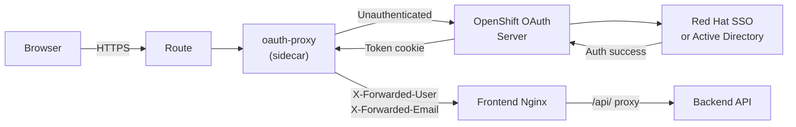

# SSO / Active Directory Integration for RCA Portal

## Current Authentication (What You Have)

- **No real identity verification.** Users type any name in a text box. Admin access is a shared password (`ADMIN_PASSWORD` env var).
- The `owner` field on jobs is whatever the user typed -- fully spoofable.
- No cookies, no JWTs, no server-side sessions.

---

## Two Approaches from the Links You Shared

### Approach A: OpenShift OAuth Proxy (Sidecar) -- RECOMMENDED for your app

**Source:** [github.com/openshift/oauth-proxy](https://github.com/openshift/oauth-proxy)

The OAuth Proxy runs as a **sidecar container** alongside your frontend Nginx container. It intercepts all incoming requests, redirects unauthenticated users to the OpenShift login page (which is backed by whatever identity provider your cluster uses -- Red Hat SSO, Active Directory/LDAP, etc.), and after successful login, forwards the request with **trusted identity headers**.



**How it works step by step:**

1. User hits the frontend route URL
2. OAuth Proxy checks for a valid `_oauth2_proxy` cookie
3. If no cookie: redirects to OpenShift login page (which shows your SSO/AD login form)
4. User authenticates with their real corporate credentials (SSO/AD/LDAP)
5. OpenShift issues an OAuth token, OAuth Proxy stores it in a cookie
6. OAuth Proxy forwards the request to Nginx with headers:

      - `X-Forwarded-User: spatidar` (the real authenticated username)
      - `X-Forwarded-Email: spatidar@redhat.com` (if available)
      - `X-Forwarded-Access-Token: <oauth-token>` (optional, for K8s RBAC checks)

7. Nginx passes these headers through to the backend API
8. Backend API **trusts these headers** (they come from the sidecar, not the browser) and uses them as the verified identity

**Who can access the app:** Controlled by OpenShift SAR (Subject Access Review):

```
--openshift-sar='{"namespace":"must-gather","resource":"services","resourceName":"must-gather-api","verb":"get"}'
```

This means: "only users who have `get` permission on the `must-gather-api` service in the `must-gather` namespace can access the app." You grant this via RBAC RoleBindings.

**Admin vs User distinction:**

- **Option 1 (OpenShift Groups):** Create an OpenShift group `rca-admins`, add admin users. Backend API calls the K8s API using the forwarded token to check group membership.
- **Option 2 (Simple):** Maintain a list of admin usernames in a ConfigMap or env var. Backend checks if `X-Forwarded-User` is in the list.
- **Option 3 (SAR-based):** Admin users get a higher-privilege RBAC binding. Backend uses the forwarded token to do a SubjectAccessReview check.

### Approach B: External OIDC Direct Authentication (OCP 4.14+)

**Source:** [Red Hat Docs - External Auth](https://docs.redhat.com/en/documentation/openshift_container_platform/4.21/html/authentication_and_authorization/external-auth)

This approach **replaces the entire OpenShift OAuth server** with an external OIDC provider (like Keycloak/RHSSO). It is for **cluster-level authentication** (who can `oc login`, who can access the OCP web console), NOT for individual app authentication.

**This is NOT what you need for the RCA Portal.** It changes how users authenticate to the OpenShift cluster itself. However, it is relevant if your cluster does not yet have Red Hat SSO / AD configured as an identity provider -- in that case, you'd use the standard [identity provider configuration](https://docs.redhat.com/en/documentation/openshift_container_platform/4.21/html/authentication_and_authorization/configuring-identity-providers) to add LDAP/AD or OIDC (RHSSO) to the cluster, and then Approach A (OAuth Proxy) would use that automatically.

---

## Recommended Architecture: OAuth Proxy Sidecar

### What Changes

#### 1. Frontend Deployment ([k8s/frontend-deployment.yaml](k8s/frontend-deployment.yaml))

Add the `oauth-proxy` as a second container in the pod:

```yaml
containers:
 - name: oauth-proxy
    image: registry.redhat.io/openshift4/ose-oauth-proxy:latest
    args:
   - --upstream=http://localhost:8080
   - --https-address=:8443
   - --tls-cert=/etc/tls/private/tls.crt
   - --tls-key=/etc/tls/private/tls.key
   - --cookie-secret=<generated-secret>
   - --openshift-service-account=must-gather-frontend
   - --pass-user-headers=true
   - --pass-access-token=true
   - --openshift-sar={"namespace":"must-gather","resource":"services","verb":"get"}
    ports:
   - containerPort: 8443
 - name: must-gather-frontend
    # existing nginx container, now only listens on localhost:8080
```

The Route changes to point at port **8443** (the oauth-proxy TLS port) instead of 8080.

#### 2. Service Account + RBAC

- Create a ServiceAccount `must-gather-frontend` with the OAuth redirect annotation:
  ```yaml
  metadata:
    annotations:
      serviceaccounts.openshift.io/oauth-redirectreference.primary: >
        {"kind":"OAuthRedirectReference","apiVersion":"v1",
         "reference":{"kind":"Route","name":"must-gather-frontend-route"}}
  ```

- Grant RBAC for users who should access the app

#### 3. Frontend Code Changes

- **Remove** `LoginPage.tsx` entirely -- users never see a login form in your app
- **Remove** the admin password field and `validateAdminPassword` API call
- **Modify** `UserContext.tsx`:
    - On app load, call a new backend endpoint `GET /api/whoami` which reads the `X-Forwarded-User` and `X-Forwarded-Email` headers and returns `{ name, email, isAdmin }`
    - Set the user state from this response
    - No more `sessionStorage` persistence needed -- the OAuth cookie handles session persistence across tabs
- **Remove** `buildAuthUrl` URL parameter hack -- new tabs share the same OAuth cookie automatically (cookies are domain-scoped, not tab-scoped)
- **Keep** `RequireAuth` but check for the whoami response instead of sessionStorage

#### 4. Backend API Changes ([Version_V1/api.py](Version_V1/api.py))

- **New endpoint:** `GET /whoami`
  ```python
  @app.get("/whoami")
  def whoami(request: Request):
      user = request.headers.get("X-Forwarded-User", "")
      email = request.headers.get("X-Forwarded-Email", "")
      is_admin = user in ADMIN_USERS  # from env/configmap
      return {"name": user, "email": email, "is_admin": is_admin}
  ```

- **Replace `owner` trust:** Instead of reading `owner` from the request body, read `X-Forwarded-User` header directly:
  ```python
  owner = request.headers.get("X-Forwarded-User", "unknown")
  ```

- **Replace admin auth:** Instead of `X-Admin-Token` header, check `X-Forwarded-User` against the admin list
- **Remove** `POST /admin/validate` endpoint (no longer needed)

#### 5. Nginx Config ([Frontend/nginx.conf](Frontend/nginx.conf))

Pass the identity headers through to the backend:

```nginx
location /api/ {
    proxy_pass http://must-gather-api:8000/;
    proxy_set_header X-Forwarded-User $http_x_forwarded_user;
    proxy_set_header X-Forwarded-Email $http_x_forwarded_email;
    # ... existing headers ...
}
```

#### 6. Admin User Configuration

Replace the `ADMIN_PASSWORD` env var with `ADMIN_USERS` (comma-separated list of usernames):

```yaml
- name: ADMIN_USERS
  value: "spatidar,cdate,admin1"
```

### Cross-tab Sessions (Solved for Free)

The OAuth Proxy sets a **domain-scoped cookie** (`_oauth2_proxy`). This means:

- All tabs share the same authenticated session automatically
- No more `sessionStorage` vs `localStorage` issues
- No more `buildAuthUrl` with `_u`, `_r`, `_t` URL parameters
- "View Progress" and "View Report" links in new tabs just work

### Prerequisite: Identity Provider on the Cluster

Before the OAuth Proxy can work, your OpenShift cluster needs an identity provider configured. Check with:

```bash
oc get oauth cluster -o yaml
```

If there is no `identityProviders` section, you need to add one:

- **For Red Hat SSO:** Add an OpenIDConnect identity provider pointing to your RHSSO instance
- **For Active Directory:** Add an LDAP identity provider pointing to your AD server

This is a cluster-admin one-time configuration, separate from the app deployment.

---

## Summary Comparison

- **OAuth Proxy (Approach A):** Sidecar in your pod; handles auth transparently; uses cluster's existing IdP; real verified identity; cross-tab sessions for free; requires minor code changes to read headers instead of self-asserted names
- **External OIDC (Approach B):** Replaces the cluster's own OAuth server; for cluster-level auth, not app-level; not what you need for the Portal

## Implementation Tasks (if you proceed with Approach A)